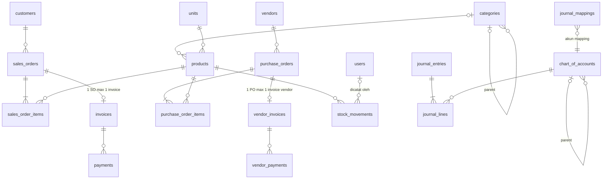

# Desain Schema Database — ERP Toko Online Single-Seller

> Versi: 1.2 (2026-08-16) — **DESAIN FINAL, sudah diimplementasikan sebagai migration & di-migrate ke MySQL `erp`** (10 migration Ran, 2026-08-16) — semua keputusan #1–#9 disetujui user 2026-08-16.
> Sumber: [plan.md](plan.md) (section 2 ERD + section 4 risiko) & [requirement.md](requirement.md)
> Target DB: MySQL 8+ / InnoDB / utf8mb4
>
> ⚠️ **Status menurut aturan-database #2 & #8:** Schema sudah diimplementasikan di `database/migrations/` (5 file, 2026-08-16).
> **Single Source of Truth adalah folder `database/migrations/`** — jika dokumen ini dan migration berbeda, migration yang menang.
> Migration lulus test schema di SQLite (`tests/Feature/DatabaseSchemaTest.php`) dan sudah dijalankan di MySQL `erp` (diverifikasi via `db:table`, 2026-08-16). Tabel spatie (permission 8.3.0 + activitylog 5.1.0) ditambahkan 2026-08-17 — total 12 migration Ran.

---

## 1. Konvensi (patuh menurut aturan-database #6)

| Aturan | Keputusan |
|---|---|
| Penamaan tabel & kolom | `snake_case` |
| Nama tabel | **Jamak** (`products`, bukan `product`) |
| Primary key | `id BIGINT UNSIGNED AUTO_INCREMENT` di semua tabel |
| Foreign key | `{tabel_tunggal}_id`, constraint name default Laravel `{table}_{column}_foreign` |
| Uang | `DECIMAL(15,2)` — **JANGAN FLOAT/DOUBLE** (catatan risiko plan) |
| Kuantitas | `DECIMAL(12,2)` — mendukung satuan pecahan (kg); stok in/out tetap exact |
| Boolean | `TINYINT(1)` (0/1), prefix `is_` |
| Status/enum | `VARCHAR` + daftar nilai sah (dicek di aplikasi) — **bukan MySQL ENUM** (sulit di-ALTER) |
| Timestamps | `created_at` / `updated_at` TIMESTAMP NULLABLE (konvensi Laravel) |
| Soft delete | `deleted_at` hanya di data master & referensi; **TIDAK di catatan keuangan/stok** (immutable) |
| String | `VARCHAR(n)` sesuai kebutuhan; teks panjang `TEXT` |

---

## 2. ERD Ringkas (Mermaid)

---

## 3. Tabel Bawaan Framework / Package (JANGAN dibuat manual)

Tabel-tabel ini dibuat oleh migration bawaan Laravel Starter Kit / package — cukup didokumentasikan, **tidak boleh dimodifikasi strukturnya** (aturan-database #4: perubahan selalu lewat migration baru).

| Tabel | Sumber | Catatan |
|---|---|---|
| `users` | Starter Kit + Fortify | Kolom detail mengikuti migration kit (password, 2FA, dll). **Verifikasi kolom aktual di `database/migrations/` sebelum query** (aturan-database #1). Catatan: kolom `role` **tidak ditambahkan** — pakai spatie |
| `sessions`, `cache`, `jobs`, `job_batches`, `failed_jobs` | Laravel default | — |
| `roles`, `permissions`, `model_has_roles`, `model_has_permissions`, `role_has_permissions` | spatie/laravel-permission | Role yang diseed: `admin`, `staff_gudang`, `staff_finance` |
| `activity_log` | spatie/laravel-activitylog | Audit trail CRUD (before/after JSON) |
| `notifications` | Laravel Notification | Notifikasi in-app (channel database) |

---

## 4. Master Data

### 4.1 `categories`
Kategori produk, mendukung nesting 1 level (atau lebih, via `parent_id`).

| Kolom | Tipe | Null | Default | Keterangan |
|---|---|---|---|---|
| id | BIGINT UNSIGNED PK | no | auto | |
| name | VARCHAR(100) | no | | Nama kategori |
| parent_id | BIGINT UNSIGNED FK→categories.id | yes | NULL | Kategori induk (NULL = akar) |
| created_at / updated_at | TIMESTAMP | yes | NULL | |
| deleted_at | TIMESTAMP | yes | NULL | Soft delete |

- FK: `parent_id` → `RESTRICT` (kategori yang punya anak tidak boleh dihapus)
- Index: `parent_id`, `name`

### 4.2 `units`
Satuan produk.

| Kolom | Tipe | Null | Default | Keterangan |
|---|---|---|---|---|
| id | BIGINT UNSIGNED PK | no | auto | |
| name | VARCHAR(50) | no | | Nama lengkap ("Kilogram") |
| abbreviation | VARCHAR(10) | no | | Singkatan ("kg") |
| created_at / updated_at | TIMESTAMP | yes | NULL | |

- UNIQUE: `abbreviation`
- Keputusan: tanpa soft delete (tabel kecil, jarang dihapus; RESTRICT via FK produk)

### 4.3 `products`
| Kolom | Tipe | Null | Default | Keterangan |
|---|---|---|---|---|
| id | BIGINT UNSIGNED PK | no | auto | |
| sku | VARCHAR(50) | no | | Kode produk unik |
| name | VARCHAR(150) | no | | |
| category_id | BIGINT UNSIGNED FK→categories.id | yes | NULL | **Keputusan: nullable** — produk boleh tanpa kategori (fleksibilitas input awal) |
| unit_id | BIGINT UNSIGNED FK→units.id | no | | Satuan dasar |
| cost_price | DECIMAL(15,2) | no | 0 | Harga beli (untuk HPP) |
| selling_price | DECIMAL(15,2) | no | 0 | Harga jual |
| stock_qty | DECIMAL(12,2) | no | 0 | ⚠️ **HANYA boleh diubah StockService** (Phase 3) |
| reorder_point | DECIMAL(12,2) | no | 0 | Ambang stok menipis |
| image_url | VARCHAR(255) | yes | NULL | URL Cloudinary |
| is_active | TINYINT(1) | no | 1 | Nonaktif = tidak tampil di katalog |
| created_at / updated_at / deleted_at | TIMESTAMP | yes | NULL | Soft delete |

- UNIQUE: `sku`
- FK: `category_id` → `SET NULL`, `unit_id` → `RESTRICT`
- Index: `category_id`, `unit_id`, `is_active`

### 4.4 `customers`
Data pelanggan (guest storefront — dibuat otomatis saat checkout, find-or-create by email/phone).

| Kolom | Tipe | Null | Default | Keterangan |
|---|---|---|---|---|
| id | BIGINT UNSIGNED PK | no | auto | |
| name | VARCHAR(100) | no | | |
| email | VARCHAR(150) | yes | NULL | Boleh kosong (guest tanpa email) |
| phone | VARCHAR(20) | yes | NULL | |
| address | TEXT | yes | NULL | Alamat kirim |
| created_at / updated_at / deleted_at | TIMESTAMP | yes | NULL | Soft delete |

- Keputusan: **tanpa UNIQUE email** (email bisa NULL / duplikat guest). Dedup saat checkout by (email OR phone) di level aplikasi
- Index: `email`, `phone`, `name`

### 4.5 `vendors`
| Kolom | Tipe | Null | Default | Keterangan |
|---|---|---|---|---|
| id | BIGINT UNSIGNED PK | no | auto | |
| name | VARCHAR(100) | no | | |
| email | VARCHAR(150) | yes | NULL | |
| phone | VARCHAR(20) | yes | NULL | |
| address | TEXT | yes | NULL | |
| is_active | TINYINT(1) | no | 1 | |
| created_at / updated_at / deleted_at | TIMESTAMP | yes | NULL | Soft delete |

### 4.6 `chart_of_accounts`
Bagan akun double-entry.

| Kolom | Tipe | Null | Default | Keterangan |
|---|---|---|---|---|
| id | BIGINT UNSIGNED PK | no | auto | |
| code | VARCHAR(20) | no | | Kode akun ("1-1000") |
| name | VARCHAR(100) | no | | Nama akun ("Kas & Bank") |
| type | VARCHAR(20) | no | | Salah satu: `asset`, `liability`, `equity`, `revenue`, `expense` |
| parent_id | BIGINT UNSIGNED FK→chart_of_accounts.id | yes | NULL | Akun header induk |
| is_postable | TINYINT(1) | no | 1 | 0 = akun header (tidak boleh di-jurnal langsung) |
| is_active | TINYINT(1) | no | 1 | |
| created_at / updated_at / deleted_at | TIMESTAMP | yes | NULL | Soft delete |

- UNIQUE: `code`
- FK: `parent_id` → `RESTRICT`
- Aturan: jurnal hanya boleh ke akun dengan `is_postable = 1` (divalidasi JournalService)

---

## 5. Modul Sales

### 5.1 `sales_orders`
| Kolom | Tipe | Null | Default | Keterangan |
|---|---|---|---|---|
| id | BIGINT UNSIGNED PK | no | auto | |
| order_number | VARCHAR(30) | no | | Format `SO-YYYYMM-####` |
| customer_id | BIGINT UNSIGNED FK→customers.id | no | | Dibuat saat checkout (guest → record customer) |
| order_date | DATE | no | | |
| status | VARCHAR(20) | no | draft | Sah: `draft`, `confirmed`, `paid`, `cancelled` |
| subtotal | DECIMAL(15,2) | no | 0 | |
| tax | DECIMAL(15,2) | no | 0 | |
| shipping | DECIMAL(15,2) | no | 0 | Ongkir |
| grand_total | DECIMAL(15,2) | no | 0 | = subtotal + tax + shipping |
| notes | TEXT | yes | NULL | |
| created_at / updated_at | TIMESTAMP | yes | NULL | |

- UNIQUE: `order_number`
- FK: `customer_id` → `RESTRICT`
- Index: `(status, order_date)`, `customer_id`

### 5.2 `sales_order_items`
Harga & qty **dikunci** saat order dibuat (snapshot harga — plan Phase 4 A.4).

| Kolom | Tipe | Null | Default | Keterangan |
|---|---|---|---|---|
| id | BIGINT UNSIGNED PK | no | auto | |
| sales_order_id | BIGINT UNSIGNED FK→sales_orders.id | no | | |
| product_id | BIGINT UNSIGNED FK→products.id | no | | |
| qty | DECIMAL(12,2) | no | | |
| unit_price | DECIMAL(15,2) | no | | Harga saat transaksi (snapshot) |
| subtotal | DECIMAL(12×qty) → DECIMAL(15,2) | no | | = qty × unit_price |

- FK: `sales_order_id` → `CASCADE` (item ikut order), `product_id` → `RESTRICT`
- Index: `sales_order_id`, `product_id`

### 5.3 `invoices`
| Kolom | Tipe | Null | Default | Keterangan |
|---|---|---|---|---|
| id | BIGINT UNSIGNED PK | no | auto | |
| invoice_number | VARCHAR(30) | no | | Format `INV-YYYYMM-####` |
| sales_order_id | BIGINT UNSIGNED FK→sales_orders.id | no | | UNIQUE — 1 SO maksimal 1 invoice |
| issued_date | DATE | no | | |
| due_date | DATE | yes | NULL | |
| amount | DECIMAL(15,2) | no | | = grand_total SO saat terbit |
| amount_paid | DECIMAL(15,2) | no | 0 | Diupdate saat payment masuk |
| status | VARCHAR(20) | no | unpaid | Sah: `unpaid`, `partial`, `paid`, `void` |
| created_at / updated_at | TIMESTAMP | yes | NULL | |

- UNIQUE: `invoice_number`, `sales_order_id`
- FK: `sales_order_id` → `RESTRICT`
- Index: `status`, `issued_date`

### 5.4 `payments`
Pembayaran customer (Midtrans / manual).

| Kolom | Tipe | Null | Default | Keterangan |
|---|---|---|---|---|
| id | BIGINT UNSIGNED PK | no | auto | |
| invoice_id | BIGINT UNSIGNED FK→invoices.id | no | | |
| amount | DECIMAL(15,2) | no | | |
| method | VARCHAR(20) | no | | Sah: `midtrans`, `bank_transfer`, `cash` |
| gateway | VARCHAR(20) | yes | NULL | `midtrans` (NULL = manual) |
| gateway_ref | VARCHAR(100) | yes | NULL | Order/transaction ID dari Midtrans |
| status | VARCHAR(20) | no | pending | Sah: `pending`, `settlement`, `capture`, `deny`, `expire`, `cancel`, `refund` |
| paid_at | DATETIME | yes | NULL | |
| created_at / updated_at | TIMESTAMP | yes | NULL | |

- **UNIQUE: `gateway_ref`** — kunci idempotensi webhook Midtrans (catatan risiko plan: notifikasi bisa datang 2×)
- FK: `invoice_id` → `RESTRICT`
- Index: `invoice_id`, `status`

---

## 6. Modul Purchase

### 6.1 `purchase_orders`
| Kolom | Tipe | Null | Default | Keterangan |
|---|---|---|---|---|
| id | BIGINT UNSIGNED PK | no | auto | |
| po_number | VARCHAR(30) | no | | Format `PO-YYYYMM-####` |
| vendor_id | BIGINT UNSIGNED FK→vendors.id | no | | |
| order_date | DATE | no | | |
| expected_date | DATE | yes | NULL | Estimasi barang datang |
| status | VARCHAR(20) | no | draft | Sah: `draft`, `ordered`, `received`, `paid`, `cancelled` — `paid` (disetujui 2026-08-16) melengkapi ERD plan demi alur Phase 5 (`draft → ordered → received → paid`) |
| subtotal | DECIMAL(15,2) | no | 0 | |
| tax | DECIMAL(15,2) | no | 0 | |
| grand_total | DECIMAL(15,2) | no | 0 | |
| notes | TEXT | yes | NULL | |
| created_at / updated_at | TIMESTAMP | yes | NULL | |

- UNIQUE: `po_number`
- FK: `vendor_id` → `RESTRICT`
- Index: `(status, order_date)`, `vendor_id`

### 6.2 `purchase_order_items`
| Kolom | Tipe | Null | Default | Keterangan |
|---|---|---|---|---|
| id | BIGINT UNSIGNED PK | no | auto | |
| purchase_order_id | BIGINT UNSIGNED FK→purchase_orders.id | no | | |
| product_id | BIGINT UNSIGNED FK→products.id | no | | |
| qty | DECIMAL(12,2) | no | | |
| unit_cost | DECIMAL(15,2) | no | | Harga beli per unit (snapshot) |
| subtotal | DECIMAL(15,2) | no | | = qty × unit_cost |

- FK: `purchase_order_id` → `CASCADE`, `product_id` → `RESTRICT`
- Keputusan: **penerimaan parsial tidak didesain** (barang diterima full per PO) — bisa ditambah `received_qty` nanti jika butuh

### 6.3 `vendor_invoices`
Tagihan dari vendor (analog `invoices`, tapi number dari vendor).

| Kolom | Tipe | Null | Default | Keterangan |
|---|---|---|---|---|
| id | BIGINT UNSIGNED PK | no | auto | |
| vendor_invoice_number | VARCHAR(50) | no | | Nomor invoice milik vendor |
| purchase_order_id | BIGINT UNSIGNED FK→purchase_orders.id | no | | UNIQUE — 1 PO maksimal 1 invoice vendor |
| invoice_date | DATE | no | | |
| due_date | DATE | yes | NULL | |
| amount | DECIMAL(15,2) | no | | |
| amount_paid | DECIMAL(15,2) | no | 0 | |
| status | VARCHAR(20) | no | unpaid | Sah: `unpaid`, `partial`, `paid`, `void` |
| created_at / updated_at | TIMESTAMP | yes | NULL | |

- UNIQUE: `(vendor_id via PO, vendor_invoice_number)` → praktisnya UNIQUE `vendor_invoice_number` + `purchase_order_id`. **Final: UNIQUE(`vendor_invoice_number`)** — toko single-vendor kecil, duplikasi nomor antar vendor jarang; revisi jika perlu
- FK: `purchase_order_id` → `RESTRICT`
- Index: `status`

### 6.4 `vendor_payments`
Pembayaran ke vendor (transfer/cash — bukan gateway).

| Kolom | Tipe | Null | Default | Keterangan |
|---|---|---|---|---|
| id | BIGINT UNSIGNED PK | no | auto | |
| vendor_invoice_id | BIGINT UNSIGNED FK→vendor_invoices.id | no | | |
| amount | DECIMAL(15,2) | no | | |
| method | VARCHAR(20) | no | | Sah: `bank_transfer`, `cash` |
| reference_no | VARCHAR(100) | yes | NULL | No. bukti transfer |
| paid_at | DATETIME | no | | |
| notes | VARCHAR(255) | yes | NULL | |
| created_at / updated_at | TIMESTAMP | yes | NULL | |

- FK: `vendor_invoice_id` → `RESTRICT`
- Index: `vendor_invoice_id`

---

## 7. Modul Inventory

### 7.1 `stock_movements`
**Append-only** (tidak boleh UPDATE/DELETE — jejak audit stok).

| Kolom | Tipe | Null | Default | Keterangan |
|---|---|---|---|---|
| id | BIGINT UNSIGNED PK | no | auto | |
| product_id | BIGINT UNSIGNED FK→products.id | no | | |
| type | VARCHAR(10) | no | | Sah: `in`, `out`, `adjust` |
| qty | DECIMAL(12,2) | no | | **Signed delta**: `in` = positif, `out` = negatif, `adjust` = ±. Invariant: `after_qty = before_qty + qty` SELALU berlaku |
| before_qty | DECIMAL(12,2) | no | | Stok sebelum |
| after_qty | DECIMAL(12,2) | no | | Stok sesudah |
| reference_type | VARCHAR(50) | yes | NULL | Polymorphic: `sales_order`, `purchase_order`, `stock_opname` |
| reference_id | BIGINT UNSIGNED | yes | NULL | ID dari reference_type |
| user_id | BIGINT UNSIGNED FK→users.id | yes | NULL | Siapa yang melakukan (untuk `adjust`/manual) |
| note | VARCHAR(255) | yes | NULL | Alasan (wajib untuk `adjust` — divalidasi aplikasi) |
| created_at | TIMESTAMP | yes | NULL | **Tidak ada `updated_at`** (immutable) |

- FK: `product_id` → `RESTRICT`, `user_id` → `SET NULL`
- Index: `(product_id, created_at)`, `(reference_type, reference_id)`
- Invariant audit: `products.stock_qty` = Σ `qty` semua movement product itu

---

## 8. Modul Finance

### 8.1 `journal_entries`
| Kolom | Tipe | Null | Default | Keterangan |
|---|---|---|---|---|
| id | BIGINT UNSIGNED PK | no | auto | |
| entry_number | VARCHAR(30) | no | | Format `JE-YYYYMM-####` |
| entry_date | DATE | no | | |
| description | VARCHAR(255) | no | | |
| source | VARCHAR(30) | no | | Sah: `sales_payment`, `purchase_received`, `purchase_payment`, `manual` |
| reference_type | VARCHAR(50) | yes | NULL | Polymorphic: `payment`, `purchase_order`, `vendor_payment`, dll |
| reference_id | BIGINT UNSIGNED | yes | NULL | |
| posted_by | BIGINT UNSIGNED FK→users.id | yes | NULL | |
| created_at / updated_at | TIMESTAMP | yes | NULL | |

- UNIQUE: `entry_number`
- FK: `posted_by` → `SET NULL`
- Index: `entry_date`, `(reference_type, reference_id)`
- Aturan: jurnal **immutable** — koreksi lewat jurnal reversal (bukan edit/delete)

### 8.2 `journal_lines`
| Kolom | Tipe | Null | Default | Keterangan |
|---|---|---|---|---|
| id | BIGINT UNSIGNED PK | no | auto | |
| journal_entry_id | BIGINT UNSIGNED FK→journal_entries.id | no | | |
| account_id | BIGINT UNSIGNED FK→chart_of_accounts.id | no | | Harus akun `is_postable = 1` |
| debit | DECIMAL(15,2) | no | 0 | |
| credit | DECIMAL(15,2) | no | 0 | |

- FK: `journal_entry_id` → `CASCADE`, `account_id` → `RESTRICT`
- Aturan (divalidasi JournalService di DB transaction):
  - Per line: **salah satu** debit/credit > 0 (bukan dua-duanya, bukan nol semua)
  - Per entry: **Σ debit = Σ credit** (balance — catatan jurnal plan)

### 8.3 `journal_mappings`
Mapping akun auto-jurnal — dari catatan risiko plan ("jangan hard-code id akun").

| Kolom | Tipe | Null | Default | Keterangan |
|---|---|---|---|---|
| id | BIGINT UNSIGNED PK | no | auto | |
| transaction_type | VARCHAR(30) | no | | Sah: `sales_payment`, `purchase_received`, `purchase_payment` |
| account_key | VARCHAR(30) | no | | Sah: `kas_bank`, `pendapatan_penjualan`, `utang_ppn`, `persediaan`, `hpp`, `hutang_vendor` |
| account_id | BIGINT UNSIGNED FK→chart_of_accounts.id | no | | |
| created_at / updated_at | TIMESTAMP | yes | NULL | |

- UNIQUE: `(transaction_type, account_key)`
- FK: `account_id` → `RESTRICT`

Contoh isi (seeder Phase 6):

| transaction_type | account_key | Contoh akun |
|---|---|---|
| sales_payment | kas_bank | 1-1000 Kas & Bank (D, grand_total) |
| sales_payment | pendapatan_penjualan | 4-1000 Pendapatan Penjualan (C, subtotal) |
| sales_payment | utang_ppn | 2-2000 Utang PPN (C, tax) |
| purchase_received | persediaan | 1-3000 Persediaan (D) |
| purchase_received | hutang_vendor | 2-1000 Hutang Vendor (C) |
| purchase_payment | hutang_vendor | 2-1000 Hutang Vendor (D) |
| purchase_payment | kas_bank | 1-1000 Kas & Bank (C) |

---

## 9. Kebijakan Relasi (FK onDelete)

| Relasi | onDelete | Alasan |
|---|---|---|
| items → orders (`*_order_items`) | CASCADE | Item tidak bermakna tanpa order |
| transaksi → master (customer/vendor/product/CoA) | RESTRICT | Jaga integritas sejarah; master pakai soft delete |
| products.category_id | SET NULL | Produk boleh yatim kategori |
| stock_movements.user_id, journal_entries.posted_by | SET NULL | Jejak tetap ada walau user dihapus |
| journal_lines → journal_entries | CASCADE | Line ikut entry |

---

## 10. Invariant & Aturan Integritas (divalidasi di service, dieksekusi dalam DB transaction)

1. **Balance**: Σ debit = Σ credit per `journal_entries` (JournalService)
2. **Stok**: `products.stock_qty` = Σ signed `qty` di `stock_movements` per produk; perubahan stok HANYA via StockService
3. **Idempotensi**: webhook Midtrans diproses sekali via UNIQUE `payments.gateway_ref` — cek sebelum insert
4. **Nomor dokumen**: semua `*_number` UNIQUE dan digenerate service (SO/PO/INV/JE + `YYYYMM` + sequence)
5. **Snapshot harga**: `unit_price`/`unit_cost` di item TIDAK berubah setelah order dibuat
6. **Amount**: `invoices.amount_paid` = Σ payments berstatus sukses; `amount_paid` > `amount` ditolak
7. **Multi-tabel atomic**: aksi yang menyentuh stok+jurnal+invoice WAJIB dalam satu DB transaction (catatan risiko plan)

---

## 11. Keputusan Desain & Deviasi dari plan.md

> ✅ **Semua keputusan #1–#9 disetujui user (2026-08-16)** — desain final, disinkronkan ke plan.md section 2, siap dibuat migration.

| # | Keputusan | Alasan | Status |
|---|---|---|---|
| 1 | Tidak ada kolom `users.role` | RBAC via spatie `model_has_roles` (konsisten pilihan RBAC plan) — hindari dual source | ✅ disetujui 2026-08-16 |
| 2 | `stock_movements.qty` = signed delta | Invariant matematis sederhana (`after = before + qty`), mudah diaudit | ✅ disetujui 2026-08-16 |
| 3 | Tabel `journal_mappings` baru | Realisasi catatan risiko plan: mapping akun fleksibel, tidak hard-code | ✅ disetujui 2026-08-16 |
| 4 | `payments` dan `vendor_payments` dipisah | Field berbeda (Midtrans vs transfer); plan hanya bilang "analog" | ✅ disetujui 2026-08-16 |
| 5 | Status PO ditambah `paid` | Alur Phase 5 butuh status terbayar; ERD section 2 belum memuatnya | ✅ disetujui 2026-08-16 |
| 6 | Qty `DECIMAL` | Satuan kg (pecahan) | ✅ disetujui 2026-08-16 |
| 7 | `chart_of_accounts.is_postable` | Jurnal hanya ke akun leaf | ✅ disetujui 2026-08-16 |
| 8 | Penerimaan parsial PO tidak didesain | Di luar scope alur plan (terima full) — mudah ditambah `received_qty` nanti | ✅ disetujui 2026-08-16 |
| 9 | `vendor_invoices.vendor_invoice_number` UNIQUE global | Penyederhanaan single-vendor kecil — revisi jadi UNIQUE per vendor jika perlu | ✅ disetujui 2026-08-16 |

## 12. Hal yang Masih Perlu Diverifikasi (aturan-database #1 & #9)

- [x] Kolom aktual tabel `users` bawaan Starter Kit/Fortify → dicek 2026-08-16: `id, name, email (unique), email_verified_at, password, remember_token, timestamps` (+ 2FA & passkeys via migration terpisah) — tanpa kolom `role`, cocok keputusan #1
- [x] Struktur tabel spatie → terverifikasi 2026-08-17 via `db:table` (laravel-permission 8.3.0: `roles` UNIQUE(name, guard_name); laravel-activitylog 5.1.0: `activity_log` polymorphic subject/causer + JSON properties) — migration di-publish & Ran
- [x] Keputusan #1–#9 → disetujui user (2026-08-16)
